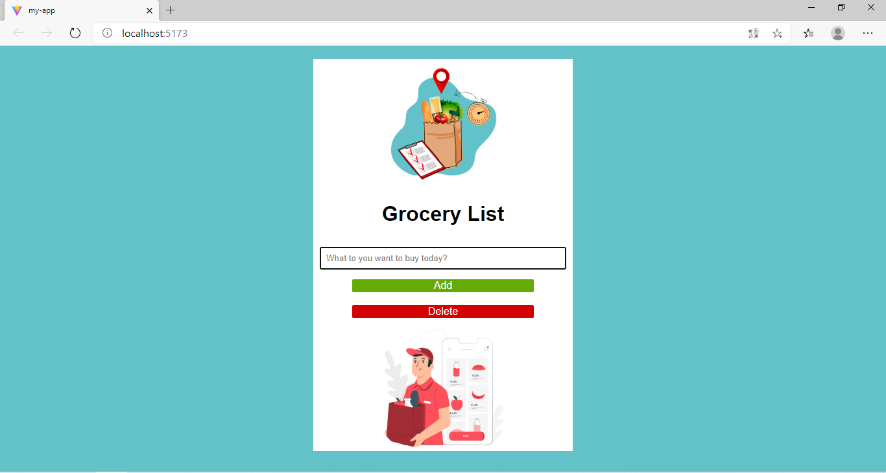

# Grocery List App

A simple and convenient web app for managing your shopping list. Create, edit, and delete items so you don't forget anything at the store.

## Possibilities

- Dynamic Add: Quickly add products to your list.
- Completed mark: Crossing out an item from your shopping list with one click
- Constant storage: Your list is automatically saved in your browser's local storage and does not disappear after refreshing the page.
- Complete Delete: Easily remove unnecessary or incorrectly added positions.
- Very convenient to use.

### My project provides the following interface:

### What technologies were used

- HTML5
- CSS3
- JavaScript 
- REACT
- TypeScript

#### Installation

1. Clone the repo 

git clone https://github.com/your-username/grocery-list.git

cd my-app

2. Launch Server development

To start the development server, run the command:

npm run dev

##### How to use

1. Enter the item name in the input field.

2. Click the "Add" button or press Enter

3. To mark an item as purchased, click on it.

4. To delete an item, click the "Delete" button (🗑️).

###### Contributing

We welcome your contribution to this project!
This project is created for educational purposes!

###### License

This project is licensed under the MIT License. This means you are free to use, modify, and distribute the software, subject to the terms and conditions of the MIT License.
 